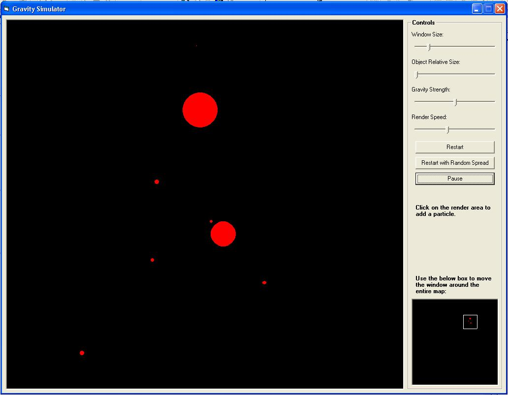



## Gravity Simulator \(2D\)

### Description

A simple 2D gravity simulator between particles of varying sizes.

The gravity strength, along with other parameters can be modified, with the program also performing 2D collision detection and reaction, using conservation of momentum and energy laws.

This is a small program I knocked up for school, so is unfortunately not commented and has scope for improvement, but it could be of interest for basic graphics and physics programming.
 
### More Info
 

             |
---                |---
**Submitted On**   |2003-04-18 16:16:04
**By**             |[Rich Hayden](https://github.com/Planet-Source-Code/PSCIndex/blob/master/ByAuthor/rich-hayden.md)
**Level**          |Intermediate
**User Rating**    |5.0 (10 globes from 2 users)
**Compatibility**  |VB 6\.0
**Category**       |[Math/ Dates](https://github.com/Planet-Source-Code/PSCIndex/blob/master/ByCategory/math-dates__1-37.md)
**World**          |[Visual Basic](https://github.com/Planet-Source-Code/PSCIndex/blob/master/ByWorld/visual-basic.md)
**Archive File**   |[Gravity\_Si1575864182003\.zip](https://github.com/Planet-Source-Code/rich-hayden-gravity-simulator-2d__1-44844/archive/master.zip)

